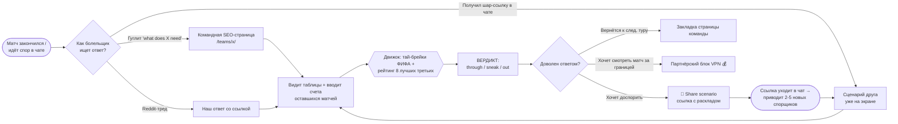

# BPMN — ключевые процессы AreWeThrough?

*Совет директоров Milkabets · 13 июня 2026. Диаграммы в Mermaid (рендерятся на GitHub).*

## Процесс 1: путь ценности пользователя (core value loop)



## Процесс 2: ежедневные операции (матчдни, 13–27 июня)

```mermaid
flowchart TD
    S([Конец игрового дня<br>~23:00 ET]) --> U[python3 tools/update_data.py]
    U --> V{Ассерты прошли?<br>72 матча / 48 команд}
    V -->|Нет| W[Глянуть вики-разметку,<br>поправить парсер / ввести счёт руками] --> U
    V -->|Да| X[node tools/build.js<br>перегенерация 48 страниц + sitemap]
    X --> T[node tools/test_engine.js]
    T -->|15/15 PASS| Y[git commit + push →<br>GitHub Pages деплоит сам]
    T -->|FAIL| W
    Y --> Z[Спот-чек живого сайта:<br>1 группа, 1 команда, 1 шар-ссылка]
    Z --> AA[30 мин дистрибуции:<br>ответы в матч-тредах Reddit + X]
    AA --> AB([Сон. Завтра повторить]))
```

## Процесс 3: монетизационный конвейер (single-run, день 1–14)

```mermaid
flowchart LR
    P1[Деплой] --> P2[Заявки день 1:<br>Search Console + Bing + AdSense + Impact/CJ]
    P2 --> P3{Аппрувы<br>1-5 дней}
    P3 -->|AdSense ок| P4[Вставить рекламный блок<br>под таблицу третьих]
    P3 -->|VPN ок| P5[Блок 'Watching from abroad?'<br>на командных страницах]
    P3 -->|Fanatics ок| P6[Кнопка 'Get the shirt'<br>возле вердикта THROUGH]
    P4 & P5 & P6 --> P7([Пик 22–27 июня:<br>монетизация работает к панике]))
```
